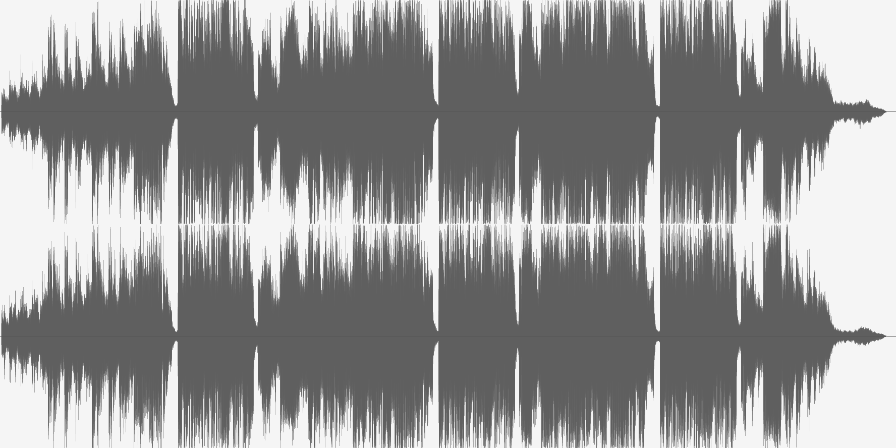

# Audio waveform generator on PHP with SoX




## Install

Install SoX and some of its handlers for different audio formats. For example, on Ubuntu:

```sh
sudo apt install sox libsox-fmt-all
```

Install this package using the [Composer](https://getcomposer.org) `require` command:

```sh
composer require maximal/audio-waveform '~1.0'
```

or add the package name to the `require` section in your `composer.json` file:
```json
"require": {
	"maximal/audio-waveform": "~1.0"
}
```

and then run:
```sh
composer update
```


## Use

In your PHP source:

```php
// Include `maximal\audio` namespace
use maximal\audio\Waveform;

// Open an audio file `track.mp3`
$waveform = new Waveform('track.mp3');

// Save its waveform to the `thumbnail.png` image file which size is 1024×512 pixels
$success = $waveform->getWaveform('thumbnail.png', 1024, 512);
```


## Settings

All settings are public static members of `Waveform` class:
 * `$linesPerPixel` is the count of lines per each pixel in horizontal axis. Default is `8`.
 * `$samplesPerLine` is the count of samples per each line. Default is `512`.
 * `$color` is the color of each line. Default is `[95, 95, 95, 0.5]` meaning the dark grey color with 50% opacity.
 * `$backgroundColor` is the background color of the waveform file.
   Default is `[245, 245, 245, 1]` meaning the light grey opaque background with 100% opacity.
 * `$axisColor` is the color of each axis. Default is `[0, 0, 0, 0.15]` meaning the black color with 15% opacity.


## Examples

Red waveform with half-transparent peaks:
```php
$waveform = new Waveform('track.mp3');
Waveform::$color = [255, 0, 0, 0.5];
$success = $waveform->getWaveform('thumbnail.png', 1024, 512);
```

Red waveform and fully transparent background:
```php
$waveform = new Waveform('track.mp3');
Waveform::$color = [255, 0, 0, 0.5];
Waveform::$backgroundColor = [0, 0, 0, 0];
$success = $waveform->getWaveform('thumbnail.png', 1024, 512);
```

## Ubuntu Linux thumbnailer for Nautilus file explorer

1. Install the package to some directory. For example: `/opt/maximal/audio-waveform-php`

2. Place the following code in the file `/usr/share/thumbnailers/waveform.thumbnailer`
   ```
   [Thumbnailer Entry]
   Exec=/opt/maximal/audio-waveform-php/thumbnailer.php %i %o %sx%s
   MimeType=audio/wave;audio/x-wav;audio/mpeg;audio/ogg
   ```

   This repository contains an example thumbnailer file. See: `usr/share/thumbnailers/waveform.thumbnailer`.

   Also you can add other MIME types to the `MimeType` section of your thumbnaler file
   as long as they are supportable by [SoX](http://sox.sourceforge.net) utility.

3. Clear thumbnail cache and restart Nautilus:
   ```sh
   rm  -rf  ~/.thumbnails
   nautilus  -q
   ```

4. Since then all your audio files with specified MIME types will be shown in Nautilus using its small waveforms.
   By default they are WAV, MP3 and OGG files.


## Contact the author

 * Website: https://maximals.ru (Russian)
 * Sijeko Company: https://sijeko.ru (web, mobile, desktop applications development and graphic design)
 * Personal GitHub: https://github.com/maximal
 * Company’s GitHub: https://github.com/sijeko
